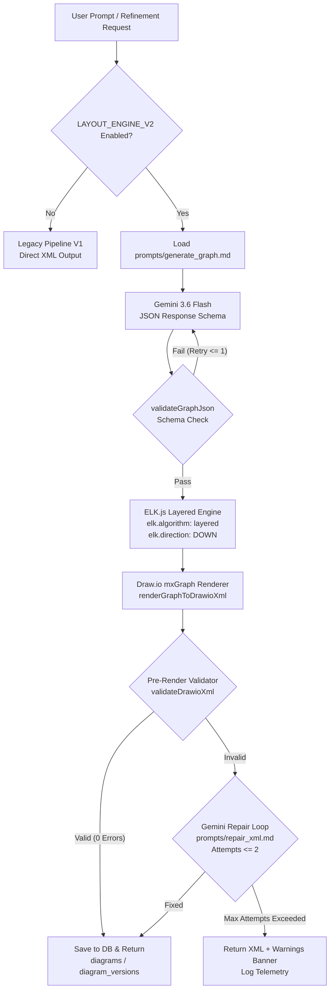

# Architecture After Rebuild (Pipeline V2)

## 1. Overview
PromptCanvas Pipeline V2 replaces the legacy non-deterministic XML generation path with a **Graph-then-Layout Pipeline**. Gemini (upgraded to `gemini-3.6-flash` on Vertex AI) is now exclusively responsible for defining **WHAT** system components exist and **HOW** they connect as a strict logical JSON graph schema. Node coordinates `(x, y, width, height)` and edge routing are generated deterministically by **ELK.js** (`elkjs`), passed through an mxGraph XML renderer, and validated by a multi-check pre-render validator with an automated repair loop safety net.

---

## 2. Mermaid Pipeline Flow Diagram

---

## 3. Key Pipeline V2 Components

| Component | File Path | Responsibilities |
| :--- | :--- | :--- |
| **Feature Flag Dispatcher** | `src/lib/featureFlags.ts` | Checks environment variable `LAYOUT_ENGINE_V2`, query param `layoutEngineV2`, request body, or header `x-layout-engine-v2`. |
| **JSON Graph Contract & Validator** | `src/lib/graph/schema.ts` | TypeScript types and Ajv JSON Schema validator enforcing unique IDs, tier references, and 1-60 node bounds. |
| **Logical Graph Generator** | `src/lib/graph/generator.ts` | Loads runtime prompts (`prompts/generate_graph.md`, `prompts/edit_graph.md`) and prompts Gemini 3.6 Flash for JSON graphs. |
| **Deterministic Layout Engine** | `src/lib/layout/elk-layout.ts` | Uses `elkjs` layered layout algorithm (`elk.direction: DOWN`) to compute `(x, y, width, height)` for tier containers and nodes. |
| **Draw.io XML Renderer** | `src/lib/render/drawio-xml.ts` | Pure function converting laid-out `ArchitectureGraph` JSON to production-grade Draw.io mxGraph XML. |
| **Visual Style Tokens** | `src/lib/render/styles.ts` | Shape, color palette, and official cloud vendor logo mappings (`GCP`, `AWS`, `Azure`, `Kubernetes`, `PostgreSQL`, `Redis`). |
| **Pre-Render Validator** | `src/lib/validate/validator.ts` | Belt-and-braces checker verifying `XML_INVALID`, `EDGE_DANGLING`, `GEOMETRY_MISSING`, `OVERLAP`, `OUT_OF_CONTAINER`, `OUT_OF_BOUNDS`, `ORPHAN_NODE`. |
| **Validator CLI Tool** | `bin/validate-cli.ts` | Command-line tool runnable via `npm run validate <file.xml>`. |
| **Validator API Route** | `src/app/api/validate/route.ts` | Internal POST endpoint `/api/validate`. |
| **Complete V2 Pipeline Harness** | `src/lib/pipeline/v2Pipeline.ts` | Coordinates graph generation, ELK layout, XML rendering, pre-render validation, repair loop, and telemetry. |

---

## 4. Environment Variables

| Variable | Default Value | Purpose |
| :--- | :--- | :--- |
| `LAYOUT_ENGINE_V2` | `true` (or `false` for A/B testing) | Enables Pipeline V2 graph-then-layout engine globally. |
| `GEMINI_MODEL_ID` | `gemini-3.6-flash` | Vertex AI / Gemini LLM model identifier. |

---

## 5. Acceptance & Test Coverage
* **Unit Tests**: Schema validation (valid + 6 invalid fixtures), Validator rules, ELK layout determinism.
* **Golden Pipeline Tests**: 10 built-in templates verified with 0 errors, 0 overlaps, and exact round-trip cell count matching.
* **Edit Flow Test**: Byte-identical existing IDs on graph mutation with minimal diff.
* **Execution Command**: `npm test`
